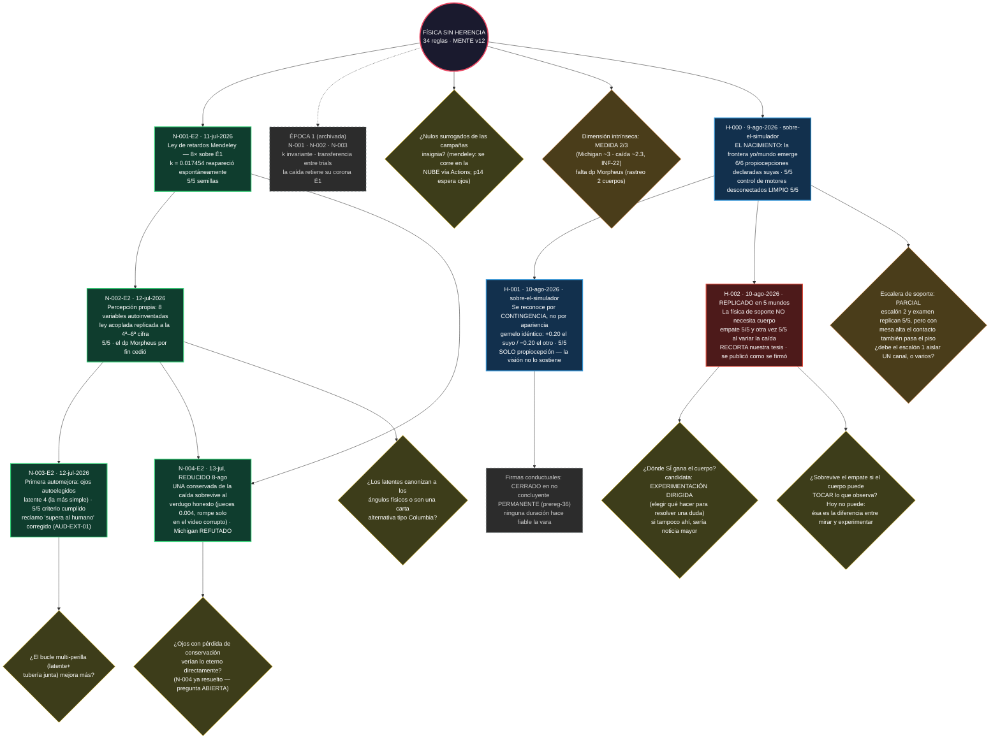

# EL ÁRBOL — mapa visual del conocimiento del proyecto
**ÉPOCA 2 EN CURSO. Actualizado el 10-ago-2026 (tarde): H-002 pasa a REPLICADO — el empate sobrevive en cinco mundos distintos (INFORME-43). H-001 sigue en pie y su mitad pendiente (las firmas conductuales) queda cerrada en NO CONCLUYENTE PERMANENTE: ninguna duración hace fiable la vara (INFORME-44). La escalera de soporte replica su escalón 2 y su examen 5/5 pero queda PARCIAL por la cláusula "único apto" (INFORME-42). La rama de física del universo (N-00X-E2) queda como estaba desde el 8-ago (INFORME-22).**

**GitHub renderiza el diagrama automáticamente al abrir este archivo. Verde = nodo validado provisional; azul = nodo de CAPACIDAD (qué puede hacer el ente, no qué es cierto del universo — marcado `sobre-el-simulador`); rojo = capacidad medida que RECORTA una tesis nuestra; naranja = en cuarentena (Regla 31); amarillo = pregunta abierta; gris punteado = archivado.**

## Cómo leerlo
- **Verde:** conocimiento validado provisional (nivel 1 de la Regla 19 — falta corroboración física y réplica independiente).
- **Azul (capacidad):** qué puede hacer el ente, no qué es cierto del universo. Nacen en el Gimnasio y llevan `sobre-el-simulador` de por vida: la gravedad de PyBullet es una ecuación que escribimos nosotros. **Jamás entran a la rama de física.**
- **Rojo (recorte):** una capacidad medida cuyo resultado **contradice una tesis nuestra**. Vale exactamente igual que un nodo verde y se escribe con el mismo detalle — es lo que separa un árbol de conocimiento de un folleto.
- **Naranja (cuarentena):** la Regla 31 encontró un defecto en el instrumento que lo validó; ni muerto ni vivo hasta la re-corrida. No entra al conectoma ni sirve de rival.
- **Amarillo:** preguntas abiertas — cada corrida nueva debe nacer de una (Regla 18).
- **Gris:** la Época 1, archivada con confianza retirada; sus leyes solo regresan venciendo.

## Cómo se actualiza
Al aprobar un nodo o abrir/cerrar una pregunta, el orquestador edita el diagrama y commitea. Verlo renderizado: abrir este archivo en GitHub.
