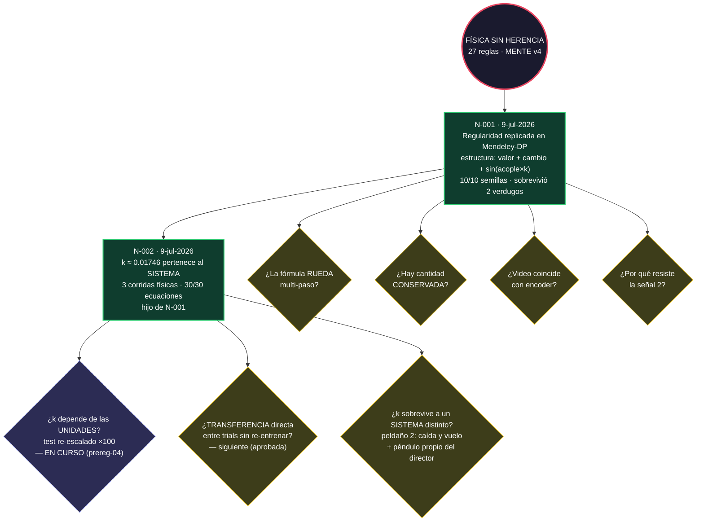

# EL ÁRBOL — mapa visual del conocimiento del proyecto
**Se actualiza con cada nodo nuevo. GitHub renderiza el diagrama automáticamente al abrir este archivo. Verde = nodo validado provisional; amarillo = pregunta abierta (candidata a nodo); gris = pregunta respondida o en curso.**

## Cómo leerlo
- **Nodos verdes:** conocimiento validado (provisional hasta subir la escalera de la Regla 19).
- **Rombos amarillos:** preguntas abiertas — el combustible de la Regla 18. Cada corrida nueva debe nacer de uno de estos.
- **Rombos punteados:** investigación en curso con prerregistro firmado.
- Los detalles de cada nodo viven en su archivo (`N-001.md`, `N-002.md`); este mapa es el índice visual.

## Cómo se actualiza
Al aprobar un nodo o abrir/cerrar una pregunta, el orquestador edita el diagrama y commitea. Verlo renderizado: abrir este archivo en GitHub (lo dibuja solo).
