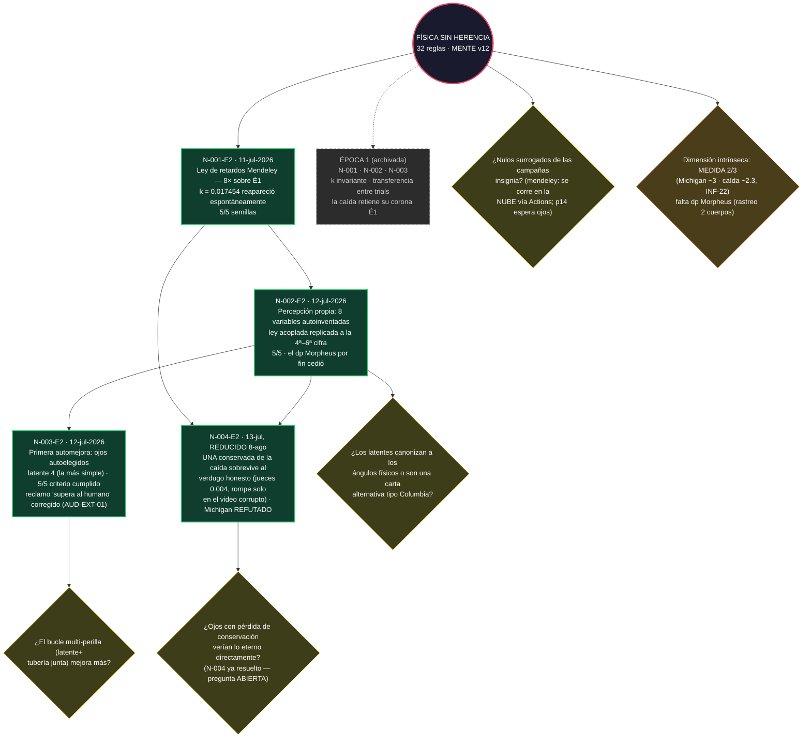

# EL ÁRBOL — mapa visual del conocimiento del proyecto
**ÉPOCA 2 EN CURSO. Actualizado el 8-ago-2026 (INFORME-22): E2-N-004 salió de cuarentena REDUCIDO — Michigan refutado por el nulo honesto, la caída sobrevive con una candidata distinta validada contra el verdugo que aprueba la Regla 31. La Época 1 vive archivada en `arbol/epoca1/` con la confianza retirada.**

**GitHub renderiza el diagrama automáticamente al abrir este archivo. Verde = nodo validado provisional; naranja = en cuarentena (Regla 31); amarillo = pregunta abierta; gris punteado = en curso.**

## Cómo leerlo
- **Verde:** conocimiento validado provisional (nivel 1 de la Regla 19 — falta corroboración física y réplica independiente).
- **Naranja (cuarentena):** la Regla 31 encontró un defecto en el instrumento que lo validó; ni muerto ni vivo hasta la re-corrida. No entra al conectoma ni sirve de rival.
- **Amarillo:** preguntas abiertas — cada corrida nueva debe nacer de una (Regla 18).
- **Gris:** la Época 1, archivada con confianza retirada; sus leyes solo regresan venciendo.

## Cómo se actualiza
Al aprobar un nodo o abrir/cerrar una pregunta, el orquestador edita el diagrama y commitea. Verlo renderizado: abrir este archivo en GitHub.
